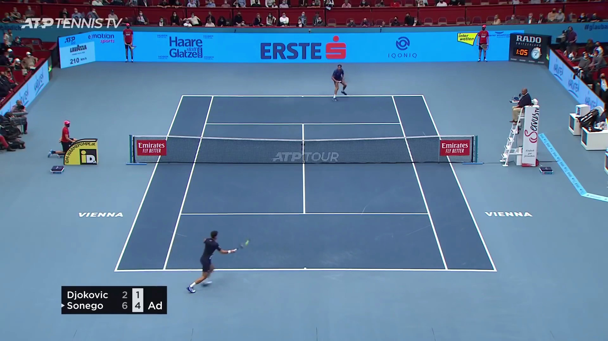
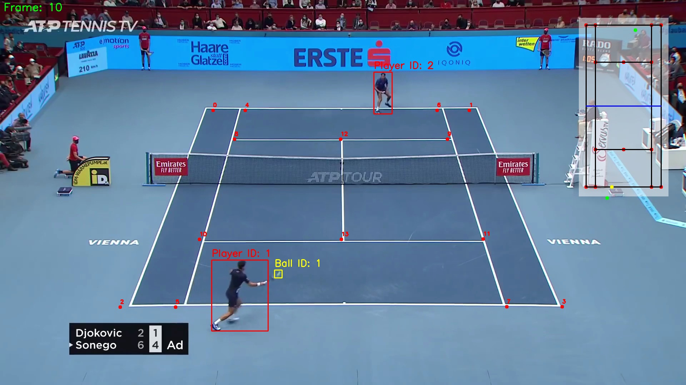

# AI-Tennis-Analysis

> Computer Vision model for analysis of a tennis game.

## Overview

- Pre-Trained YOLOv11 model for player tracking.
- Custom-trained YOLOv11 model for ball tracking.
- Custom CNN architecture in PyTorch for court keypoint selection.
- RANSAC homography for mapping the video of a game to a 2D simulated model.
- Key analysis statistics extracted, such as shots and player movement.

## Visual Results

### Input

### Output

